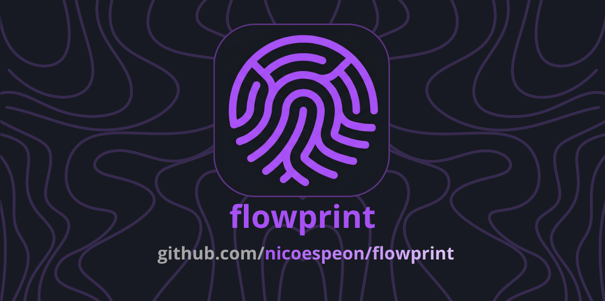

<p align="center">
  
</p>

<p align="center">Trace data flow across TypeScript codebases. See where a variable's data comes from.</p>

VS Code's built-in Call Hierarchy works for function calls, but not for data. **flowprint** fills that gap: point at a variable and see the full chain of assignments, parameters, and property accesses that connect it to the rest of your codebase.

## Example

Given this code:

```ts
// service.ts
export function process(data: { toto: string }) {
	const value = data.toto;
	console.log(value);
}

// handler.ts
import { process } from "./service";
const input = { toto: "hello" };
process(input);
```

Running `flowprint trace service.ts:3:8` on `value` produces:

```
value (service.ts:3:7)
└── data.toto (service.ts:3:14)
    └── input.toto (handler.ts:3:6)
```

The trace follows `value` upstream through `data.toto` (property access on a parameter), across the file boundary to `input.toto` (the argument at the call site in handler.ts). Each node shows its file and position so you can jump straight to the code.

## Install

```sh
npm install -g flowprint
```

Or run without installing:

```sh
npx flowprint trace src/handler.ts:5:12
```

## Usage

```sh
flowprint trace <file>:<line>:<col> [options]
```

**`<file>:<line>:<col>`** — The symbol to trace. Line and column are 1-based (matching your editor's status bar).

### Options

| Flag                   | Description                             | Default     |
| ---------------------- | --------------------------------------- | ----------- |
| `--direction upstream` | Trace where data comes from             | `upstream`  |
| `--compact`            | Hide file paths and positions in output | off         |
| `--tsconfig <path>`    | Path to tsconfig.json                   | auto-detect |

### What it traces

flowprint follows data upstream through:

- Variable assignments (`const x = y`)
- Chained assignments (`a = b = c`)
- Function parameters to call-site arguments
- Property access (`obj.name`)
- Method call receivers (`items.filter(...)` traces to `items`)
- Cross-file imports

### Not yet implemented

- Downstream tracing (where does data flow _to_)
- Destructuring (`const { x } = obj`)
- Arrow functions and function expressions
- JSON and Mermaid output formats
- VS Code extension

## Contributing

See [CONTRIBUTING.md](CONTRIBUTING.md) for setup instructions and development workflow.

<!-- ALL-CONTRIBUTORS-BADGE:START -->

[](#contributors)

<!-- ALL-CONTRIBUTORS-BADGE:END -->

### Contributors

Thanks to these people for contributing:

<!-- ALL-CONTRIBUTORS-LIST:START -->
<table>
  <tbody>
    <tr>
      <td align="center" valign="top" width="14.28%"><a href="https://github.com/nicoespeon"><br /><sub><b>Nicolas Carlo</b></sub></a></td>
    </tr>
  </tbody>
</table>
<!-- ALL-CONTRIBUTORS-LIST:END -->

## License

[MIT](LICENSE)
